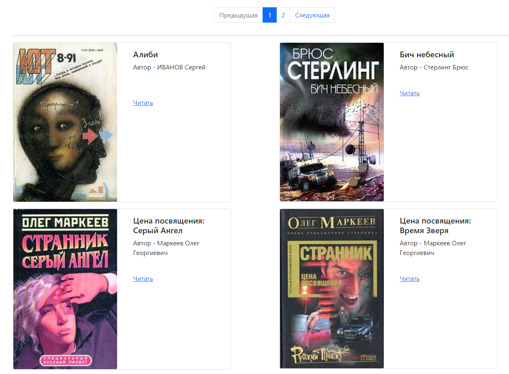

# Парсим сайт с книгами

Скрипт для создания своего сайта с библиотекой.

## Запуск

Для запуска блога у вас уже должен быть установлен Python 3.

- Скачайте код
- Установите зависимости командой 
```python
    pip install -r requirements.txt
```
- Указать свой путь к *.json файлу 
```python
    python3 render_website.py --json_path
```
- Запустить рендер сайта
```python 
    python3 render_website.py
```

## Пример сайта

### Моя Онлайн версия:

Онлайн ссылка на [мой сайт](https://bogpc228.github.io/Parse-the-online-library/pages/index1.html).

### Оффлайн версия:

После запуска скрипта можете переходить на локальный [сайт](http://127.0.0.1:5500/pages/index1.html).

Чтобы запустить сайт прямо из папки, просто зайдите в проект и запустите ```index.html```



## Цели проекта

Код написан в учебных целях — это урок в курсе по Python и веб-разработке на сайте [Devman](https://dvmn.org).
